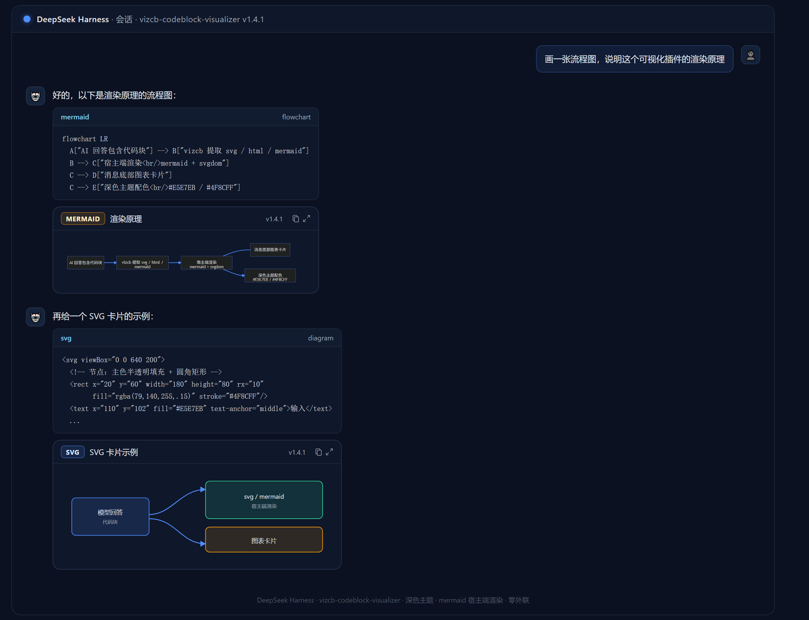

# vizcb-codeblock-visualizer


DeepSeek Harness 可视化插件：把模型回答中的 ````svg` / ````html` / ````mermaid` 代码块渲染为消息底部的内嵌图表卡片；并把 ````present-files` 指令渲染为**工作区文件预览面板**（HTML/图片/文本 + 文件卡片）。mermaid 为宿主端渲染（mermaid + svgdom，**运行在独立 worker_threads**，不污染宿主进程），**运行时零网络外联**（无 CDN、无 iframe 脚本）；依赖由安装时自动拉取（仓库不内置 node_modules）。

## 效果预览



## 功能

- **SVG 卡片**：宿主端 DOMPurify 消毒（剥 script / 事件属性 / javascript: 链接）+ 客户端宽松校验（与渲染路径一致），轻微 XML 瑕疵也能正常渲染
- **HTML 卡片**：空 sandbox iframe（默认禁脚本；`htmlAllowScripts` 可开 iframe 内脚本）
- **Mermaid 卡片**：宿主端渲染（mermaid + svgdom → SVG，**独立 worker_threads 隔离**），24 种方言别名（flowchart/graph/sequenceDiagram…）；深色主题下文字/连线/箭头按宿主色板提亮（文字 `#E5E7EB`、连线 `#4F8CFF`），节点文字超出时自动扩宽矩形 + viewBox 自适应；同一图的并发请求合并、结果内存缓存
- **图注标题**：自动提取代码块上方的标题行
- **交互**：复制源码 / 全屏灯箱放大（Esc、点背景、按钮关闭）/ **保存导出**（原生对话框自选位置与格式：PNG / SVG；HTML 导出源文件）
- **失败可见化**：未渲染时显示原因通知条；mermaid 渲染错误显示具体原因
- **可预览文件（present-files）**：模型在回复末尾输出 ````present-files` 块列出最终成品文件 → 第一行自动打开预览面板（HTML 走 `sandbox="allow-scripts"` iframe，图片大图，css/js/文本源码），其余排成文件卡片点击切换；**mtime 轮询**：文件被改写后预览自动整体刷新；卡片支持**复制完整路径**、**在系统文件管理器中显示**（宿主 `explorer /select`）；路径先 resolve + 包含性校验（防 `../` 越界），经随机 token 前缀暴露，单文件超 `previewMaxBytes` 拒绝；用户手动关闭预览后本次会话不再自动弹开
- **工程化**：配置化（8 块/条、64KB/块、重试间隔、画布底色、mermaid 深色模式、预览上限等）、per-seq 缓存（可重试失败不缓存，重试真实重取）、2s 自动重试、请求体限制 + 每会话限流 + mermaid 全局限流、`/vizcb/debug` 自检、启动日志 `[vizcb] mounted vX`、`node --test` 15 用例 + GitHub Actions CI

## 安装

**前提**：目标 profile 为标准 DSH web 应用栈（含 `dsh-web-app` 的 turnTail 槽位，以及 `systemPrompt` / `webServer` / `sessionQuery` 服务）。桌面版 2.0.4 已验证；独立 `dsh web`（web profile）v1.4.1 实测可用。

### 方式 A —— 一键安装脚本（推荐）

```sh
# 1. 获取源码（git clone 本仓库 / 下载 zip）
# 2. 在仓库根目录运行（会自动复制插件 + 写入 bundles + 缺依赖时 npm install）：
powershell -ExecutionPolicy Bypass -File install-vizcb.ps1
# 其他 profile：
powershell -ExecutionPolicy Bypass -File install-vizcb.ps1 -ProfileName web
# 3. 重启 DeepSeek Harness
```

### 方式 B —— 手动复制

1. 把 `vizcb-codeblock-visualizer` 目录复制到目标 profile 的 `node_modules/`
2. 在 profile 的 `package.json` 的 `dsh.profile.bundles` 追加 `"vizcb-codeblock-visualizer"`
3. （若未带 node_modules）在插件目录执行 `npm install`
4. 重启

### 方式 C —— 作为 npm/git 依赖安装

在目标 profile 的 `package.json` 中把插件加入依赖并注册 bundle，然后执行 `pnpm install`（桌面版自带 pnpm，或直接用 `dsh plugin` 命令转发）：

```jsonc
// ~/.dsh/profiles/<name>/package.json
{
  "dependencies": {
    "vizcb-codeblock-visualizer": "github:Reseezhang/vizcb-codeblock-visualizer"
  },
  "dsh": {
    "profile": {
      "bundles": ["@deepseek-ai/dsh-base", "@deepseek-ai/dsh-web-app", "vizcb-codeblock-visualizer"]
    }
  }
}
```

或者用 dsh CLI 一行安装依赖（随后仍需把 `"vizcb-codeblock-visualizer"` 追加进上述 bundles 数组）：

```sh
dsh plugin --profile <name> add github:Reseezhang/vizcb-codeblock-visualizer
```

> 依赖（mermaid/jsdom/dompurify/svgdom）由 npm/pnpm 从 registry 自动拉取，仓库不内置 node_modules。

## 配置

默认值见 `lib/index.js` 的 `DEFAULTS`。在 profile 级 `cordis.patch.yml` 按 id 覆盖：

```yaml
- id: vizcb-codeblock-visualizer
  config:
    maxBlocks: 8              # 每条消息最多渲染块数
    maxBlockChars: 65536      # 单块最大字符数
    retryDelayMs: 2000        # 空结果重试间隔
    minSvgHeight: 120         # SVG 无 viewBox 时的兜底高度
    mermaidEnabled: true      # 是否渲染 mermaid
    mermaidTextColor: "#E5E7EB"  # mermaid 深色主题文字/标签颜色（对齐宿主色板）
    mermaidLineColor: "#4F8CFF"  # mermaid 连线/箭头/生命线颜色
    canvasBg: "#0F172A"       # 卡片图区 / HTML / PNG 导出的画布底色
    mermaidDark: null         # mermaid 主题：null=自动检测（data-theme/prefers-color-scheme）、true/false=强制
    htmlAllowScripts: false   # HTML iframe 是否允许脚本（安全权衡，默认关）
    debugLog: false           # 请求级调试日志（开启写 os.tmpdir()/vizcb-debug.log）
    mermaidRateMax: 30        # mermaid 渲染全局限流（滑动窗口内最大次数）
    previewEnabled: true      # 是否启用 present-files 文件预览
    workspaceRoot: ""         # 工作区根目录；留空 = sandboxPolicy.workspaceRoot → 进程 cwd
    previewMaxBytes: 5242880  # 单文件预览上限（超过提示用浏览器打开）
    previewPollMs: 3000       # 文件变化轮询间隔（ms）
    maxFiles: 12              # 一次展示最多卡片数
```

## 卸载 / 回滚

删掉 bundles 条目 + 删除插件目录 + 重启。

## 文件结构

```
vizcb-codeblock-visualizer/
├── package.json        # dsh.bundle.patch + dsh.client 声明 + files 白名单
├── cordis.patch.yml    # 挂载行 + 配置说明
├── README.md
├── DEVELOPMENT.md      # 完整开发历程与踩坑记录
├── LICENSE             # MIT
├── install-vizcb.ps1   # 一键安装脚本（按 files 白名单复制）
├── test/
│   └── index.test.mjs  # node --test 冒烟测试
├── .github/workflows/ci.yml
└── lib/
    ├── index.js        # Host：提示词 section + read-turn / mermaid.svg / p/<token> 预览 / reveal / debug 路由 + 消毒 + worker 管理
    ├── client.js       # Client：turnTail 渲染 + 灯箱 + 保存导出 + 预览面板（__ModuleLoader__ 格式）
    └── mermaid-worker.mjs # Worker：mermaid + svgdom 隔离渲染
```

## 版本历史

- 1.6.0 可预览文件（WorkBuddy html-preview-spec 落地）：模型输出 ````present-files` 指令 → 宿主校验路径（resolve + 工作区包含性）→ 同源 `/vizcb/p/<token>/` 提供预览（随机 token + 越界防护 + 大小上限 + no-store）→ 客户端预览面板 + 文件卡片（点击切换 / 复制路径 / 打开所在目录 / mtime 轮询自动刷新 / 关闭后不再自动弹开）；iframe 仅 `sandbox="allow-scripts"`；提示词新增"可预览文件展示规范"（含"不复述内容"规则）
- 1.5.0 代码评审落地：mermaid 渲染移入独立 worker_threads（不再污染宿主 globalThis）；SVG/mermaid 输出宿主端 DOMPurify 消毒后才返回客户端；mermaid 渲染全局限流 + 同 key 在途去重 + 串行化；`readTurn` 重试缓存修复（可重试失败不再入缓存）；调试日志改配置项 `debugLog`（默认关）；`injectBootGlobals` 转义 `</script>`；主题适配（`canvasBg` 配置化 + mermaid dark 自动检测/可强制）；灯箱与卡片同套 SVG 校验；`node --test` 用例 + GitHub Actions CI；install-vizcb.ps1 按 files 白名单复制（排除 .git/test）
- 安装脚本/文档：`install-vizcb.ps1` 加 UTF-8 BOM（无 BOM 时中文注释在 Windows PowerShell 5.1 下被按 ANSI 解析导致脚本解析崩溃）；README 补充独立 `dsh web`（web profile）实测可用
- 1.0.0 动态插件移植为 bundle（路由 fetch）
- 1.1.0 加固：SVG 校验 / 图注标题 / 复制缩放 / mermaid / 配置化 / 缓存 / 自检 / 限流 / 网格 / i18n
- 1.2.0 全屏灯箱放大
- 1.2.1 mermaid 方言别名 + 普通代码块静默
- 1.3.0 mermaid 改宿主端渲染（弃 CDN/iframe）
- 1.3.1 卡片版本徽标 + fetch+inline
- 1.3.2 请求级调试日志
- 1.3.3 箭头可见性增强
- 1.3.4 SVG 校验对齐渲染路径
- 1.4.0 保存导出（PNG/SVG/HTML）
- 1.4.1 修复深色主题渲染（dark 标志丢失导致浅色主题）；mermaid 配色对齐宿主色板（文字 `#E5E7EB`、连线/箭头 `#4F8CFF`）；节点文字自适应（自动扩宽矩形 + viewBox）

完整踩坑历程见 [DEVELOPMENT.md](./DEVELOPMENT.md)。
